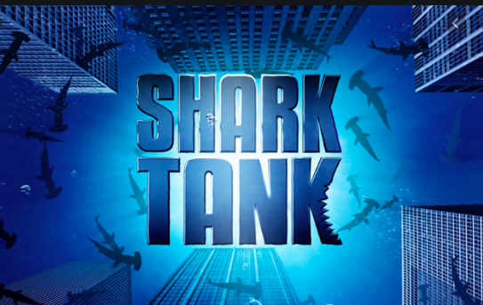
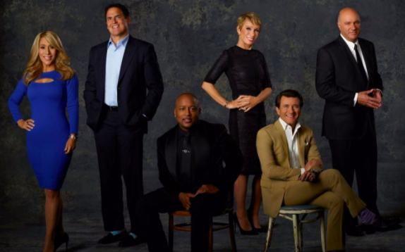
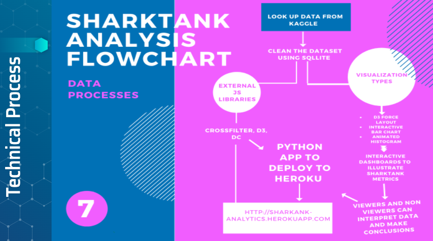
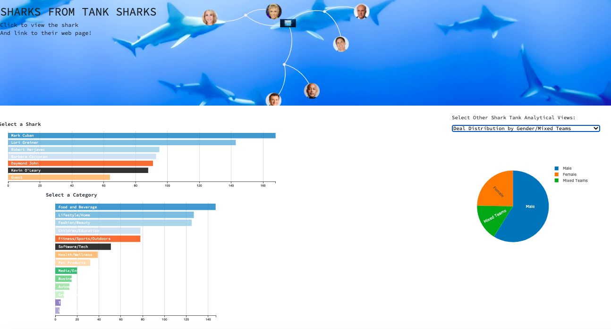

# Shark Tank Analytics

Hello Sharks! Today we will be pitching you our product, Shark Tank Analytics, at $10 million for a 25% interest.  
Our product will enhance knowledge about Shark Tank and add value to the viewing experience.  
Are you ready to dive with us into the tank? 

### The American Dream:

Shark Tank has represented the American Dream by connecting visionary entreupeneurs with successful investors know as the Sharks.  
The entreupeneurs pitch their products to six Sharks with capital and mentorship opportunities.  
* `11` seasons
* `564` deals closed 
* `991` deals pitched
* `$163 million` invested. 
  

### The Sharks:

`Lori Grenier`: the Queen of QVC, with millions made on patents and investments 
`Mark Cuban`: billionaire and owner of the Dallas Mavericks 
`Daymond John`: fashion mogul with global fashion influence 
`Barbara Corcoran`: built a real estate empire in New York and beyond 
`Robert Herjavec`: sold his first cyber security company for hundreds of millions 
`Kevin O'Leary`: Mr. Wonderful, investor that sold his toy company for millions

###  Product Development:

`Kaggle`: The data was imported from Kaggle 
`Excel`: The data was in Excel format upon import 
`SQLite`: The data was then exported into SQLite 
`Flask`: Python app for transition from data to visualization 
`JavaScript`: Visualizations were created through Crossfilter, D3 and DC 
`Visualizations`: DC Force Layout, Interactive Bar Chart, Animated Histogram, Pie Chart 
`Heroku`: Finished product deployment

###  The Product Dashboard: https://sharktank-analytics.herokuapp.com/

`Top`: DC Force Layout displaying all Shark profiles, learn more about your favorite Shark by pressing their profile and link to their biographical page 
`Lower Left`: Crossfilter Interactive Bar Chart and Animated Histogram, to see the data on categories your favorite Shark has invested in  
`Lower Right`: Pie Chart detailing gender demographics on Shark investments for more analytics on your favorite Shark 

###  Conclusion:

Our analytic tool will provide the best analysis on: 
* Your favorite Shark's biography 
* Your favorite Shark's investment category 
* Information on investment categories 
* Gender demographics on Shark investments 

We are open to hearing your offers Shark! 
 

WE'RE OUT!

